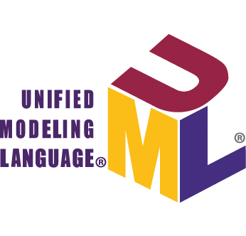
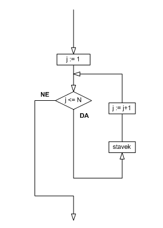
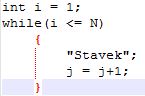

Primož Ratej Cvahte

FERI, ITK VS 2016/17 2. letnik

18.10.2016

## Kaj je UML

Slika pove 1000 besed zato je UML ali Unified Modeling Language bil tudi na
začetku zasnovan. UML je poenoten jezik modeliranja. Je računalniški standard ki
se uporablja za načrtovanje informacijskih sistemov, procesov, uporablja se tudi
kot podpora kodiranju. Na kratko UML je diagram poteka. UML se uporablja za
prikaz možnih poti podatkov skozi sistem oz. proces. Je eden izmed načinov
zapisa algoritma vendar nima tako stroge oblike zapisa kot dejanski algoritem
zato nam je samo v podporo h kodiranju.

UML diagram Dejanska koda

UML diagram predstavlja točno določeno zaporedje ukazov, procesov nekega
računalniškega programa. Različni simboli predstavljajo vnos in izpis podatkov,
odločitve, omejitve, izjeme, podprograme i.t.d.

## Zgodovina

UML začetki segajo v leto 1994-95 ko je padla ideja o standardu za grafično
načrtovanje programov. Začetniki so bili Grady Booch, Ivar Jacobson, in James
Rumbaugh v podjetju Rational Software. Podjetje se je v celoti posvečalo
izdelavi orodij ki bi pomagali pro načrtovanju ali samem kodiranju
informacijskih sistemov. Kasneje je bilo podjetje prodanu IBM-u za 2,1 miljardo
dolarjev februarja 2003. UML je bil leta 1997 posvojen od podjetja Object
Management Group (OMG) in je v rokah te organizacije do danes. UML kot
načrtovalni jezik je postal standard leta 2005 ko ga je organizacija ISO tudi
potrdila. Od takrat redno prihajajo nove posodobitve.

UML konstanto razvijal od sredine 90. in ima korenine z začetki objektno
orientiranega programiranja iz 80. Izhaja iz Boochove notacije ki uporablja
objetktno-modelirano tehniko (OMT) in objektno-orientiran programski jezik
(OOSE).

### UML 1x

Pod tehničnim nadzorom glavnih treh (Rumbaugh, Jacobson in Boochom) je bila
organizirana skupina UML Partners. Njen glavni namen je bilo dokončati UML
specifikacije, in ga predlagati skupini OMG za standardizacijo. V tej skupini so
bile tudi večja vplivna podjetja kot so HP, DEC, IBM in Microsoft. Partnerji so
predstavili osnutek in verzijo UML 1.0 skupini OMG januarja 1997. UML 1.1 je bil
z strani OMG potrjen Avgusta 1997 in prevzet od te iste skupine Novembra istega
leta.

### UML 2x

UML 2.0 je leta 2005 zamenjal tedaj obstoječo verzijo 1.5 z namenom izboljšati
jezik za novejše in naprednejše funkcionalnosti. Čeprav verzija 2.1 nikoli ni
bila izdana ji sledita verzija 2.1.1 in verzija 2.1.2 leta 2007. Med letom 2007
in danes je izšlo še nekaj verzij zadnja med njimi je 2.5 ki je bila izdana
oktobra 2012 kot beta in je bila komaj junija 2015 izdana kot dokončana.

## Oblika

UML ponuja možnost za vizualizacijo arhitekture nekega programa. Zato uporablja
elemente kot so:

-   Aktivnosti

-   Samostojne komponente in kako komunicirajo z ostalimi procesi.

-   Povezave med določenimi procesi.

## Metode izdelave informacijskih sistemov

UML kot sama ni metoda za izdelavo informacijskih sistemov. Vendar deluje z roko
v roki z programsko kodo saj ji da neko vizualno podlago in razlago, omogoča
hitrejši pregled nad procesi in posledično hitrejše reševanje problemov in
nadgradnjo.

## Diagrami

UML 2.x ponuja kar nekaj različnih diagramov, ki so razdeljeni v dve kategoriji
strukturne diagrame in ostale diagrame.

### Strukturni diagrami

Strukturni diagrami predstavljajo komponente ki morajo biti prisotne v sistemu
da sistem deluje. Ker struktura prikazuje strukture, ki pa se v veliki meri
uporabljajo za dokumentacijo programske kode je najbolj primeren način
dokumentacije. Na primer komponente diagrama opisujejo, kako je sistem razdeljen
na svoje sestavne dele in kako so ti deli odvisni in povezani drug z drugim.

### Diagrami obnašanja

Diagrami obnašanja poudarijo tisto kar se mora zgoditi v modeliranem sistemu.
Ker ti diagrami prikazujejo obnašanje sistema se v veliki meri uporabljajo za
opis funkcionalnosti sistema.

### Diagrami interakcij

Diagrami interakcij spada med diagrame obnašanja. Prikazuje nadzor in pretok nad
podatki v sistemu. Na primer sekvenca diagrama prikazuje kako objekti med seboj
komunicirajo v smislu zaporedja sporočil.

## Kritike na UML

Preveč kompleksen po navadi z komunikacijo z stranko. Stranka ni navajena
takšnih diagramov ampak ima rada končni produkt zato je predstavljati nek
projekt naročniku ki ni imel nikoli predznanja z UML načrtovanjem nesmiselno.

UML in dejanski produkt je treba spreminjati sočasno UML je načrt nekega sistema
zato ko spremenimo sistem moramo spremeniti tudi UML.

## Zaključek

UML jezik nam služi kot podpora za načrtovanju kakršnih koli problemov pa naj
bojo to računalniški, matematični, ekonomski, projektni. Vse več pristopov k
problemom se rešuje z UML načrtovalno tehniko saj tam lahko hitro razvijemo
približek nekega sistema in že preden dejansko naredimo produkt rešimo nekatere
napake ki jih mogoče pri izdelavi nebi odkrili.
